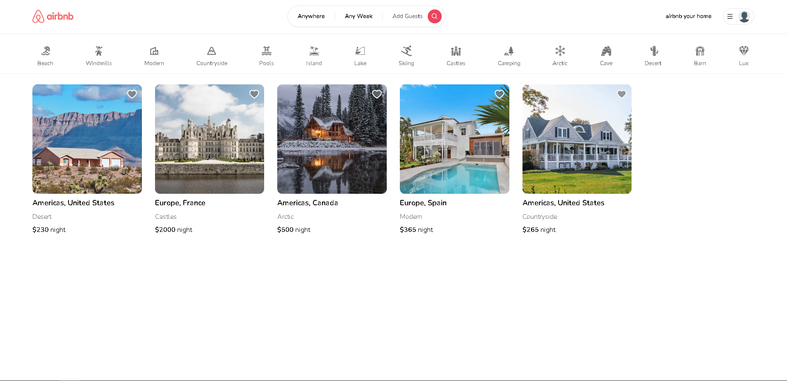

<h1>Airbnb Clone - A Community Listing Website</h1>

## Table of Contents

- [Table of Contents](#table-of-contents)
- [Overview](#overview)
- [Built With](#built-with)
- [Purpose](#purpose)
- [Contact](#contact)

## Overview

Link to website - [Airbnb Clone](https://rent-homes-website.vercel.app/)

This project is a recreation of the renowned Airbnb website, serving as a community listing platform where users can both list their properties for rent and rent others' accommodations. Throughout the development of this project, I gained invaluable insights. It provided me with a deeper understanding of the synergy between Prisma and MongoDB, as well as the intricacies of conducting API calls on the backend using Prisma for tasks like retrieving listings, managing favorites, processing reservations, and user creation. Additionally, I recognized the immense benefits of crafting reusable components that enhance the website's overall efficiency and user experience.

## Built With

- [Next.js](https://nextjs.org/)
- [Tailwind](https://tailwindcss.com/)
- [Hosted on Vercel](https://vercel.com/)
- [Prisma](https://www.prisma.io/)
- [MongoDB](https://www.mongodb.com/)

## Purpose

Was created just for fun and to hone my skills in Next.js and Tailwind.

## Contact

- [Github](https://github.com/MCervone14)
- [My Portfolio](https://github.com/MCervone14/Portfolio-Website)
